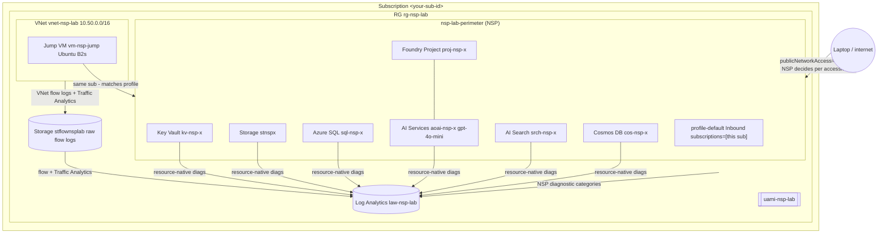
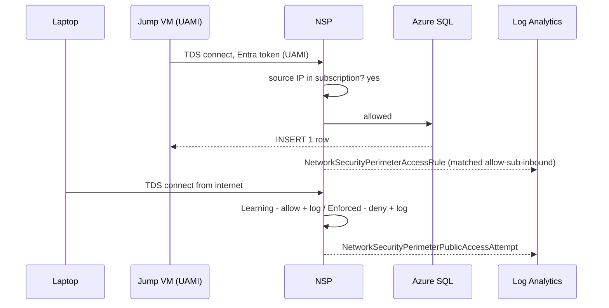
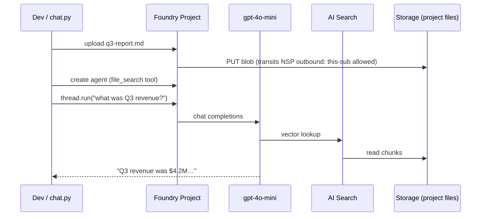
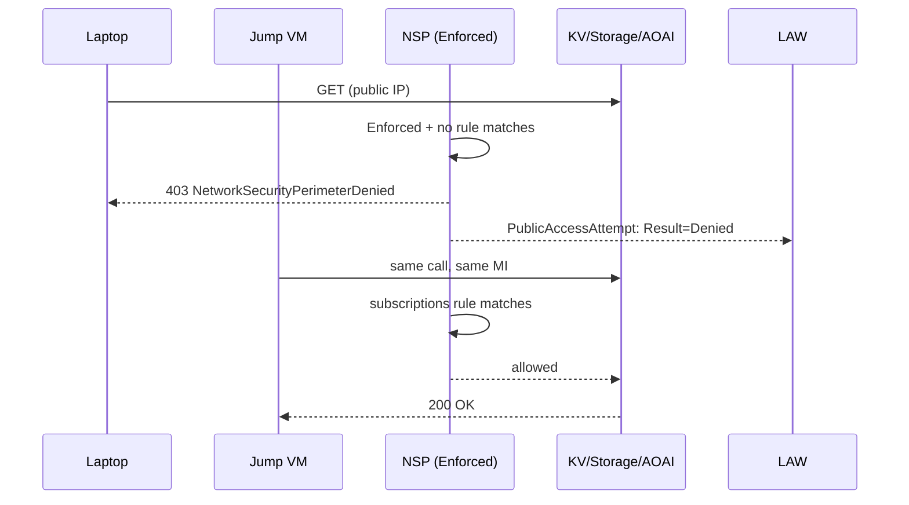

# Architecture

## One picture



## Components

| Component | SKU / mode | In perimeter? | Why |
|---|---|---|---|
| Key Vault `kv-nsp-…` | Standard, RBAC, soft-delete on | ✅ | Holds zero secrets (intentionally) — proves NSP works over a KV with `publicNetworkAccess=Enabled` |
| Storage `stnsp…` | StorageV2, RA-LRS, key access disabled, MI only | ✅ | Backing store for Foundry uploads in demo 2 |
| Azure SQL `sql-nsp-…/db-nsp-lab` | Server + Basic DB, Entra-only auth | ✅ | Demo 1 writes here |
| AI Services `aoai-nsp-…` | Multi-service S0 (`Microsoft.CognitiveServices/accounts` kind=AIServices) + `gpt-4o-mini` deployment | ✅ | Foundry + AOAI inference |
| Foundry project `proj-nsp-…` | New simplified model: `Microsoft.CognitiveServices/accounts/projects` | ✅ via parent | Agent + file_search demo |
| AI Search `srch-nsp-…` | Basic, MI auth | ✅ | Vector store for file_search |
| Cosmos DB `cos-nsp-…` | Serverless, SQL API | ✅ | Stores agent state / threads |
| Log Analytics `law-nsp-lab` | PerGB2018, 30 day retention | ❌ | Sink for all NSP diag categories |
| UAMI `uami-nsp-lab` | UserAssigned | ❌ | Single identity attached to jump VM + Foundry connections; granted data-plane roles |
| Jump VM `vm-nsp-jump` | Ubuntu 22.04, B2s, public IP, NSG :22 from your IP | ❌ | "Inside the sub" demo client |
| NSP `nsp-lab-perimeter` | 1 default profile, 2 access rules | n/a | The thing under test |

## NSP layout

```text
nsp-lab-perimeter
└── profiles/
    └── default
        ├── accessRules/
        │   ├── allow-sub-inbound  (Inbound,  subscriptions=[sub])
        │   └── allow-sub-outbound (Outbound, subscriptions=[sub])
        └── resourceAssociations/
            ├── kv-assoc        accessMode=Learning
            ├── storage-assoc   accessMode=Learning
            ├── sql-assoc       accessMode=Learning
            ├── aoai-assoc      accessMode=Learning
            ├── search-assoc    accessMode=Learning
            └── cosmos-assoc    accessMode=Learning
```

`scripts/20-toggle-enforced.sh` flips every association to `Enforced`. `21-toggle-learning.sh` flips them back.

## Per-demo flow

### Demo 1 — SQL writes


### Demo 2 — Foundry knowledge agent


### Demo 3 — Lockdown


## Naming

`<resource-prefix>-nsp-<4-char-rand>` keeps things globally unique. Override with `var.name_prefix` in tfvars.
