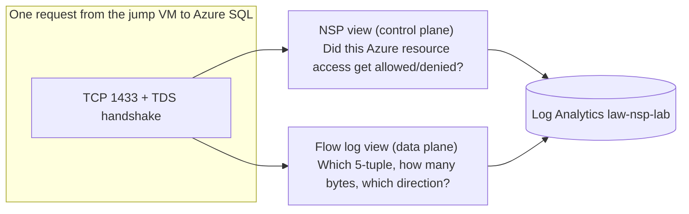

# Observability

The whole point of NSP for an SRE is the **uniform log schema** across every resource type. This file is the cheat sheet.

## Where the logs live

| Log destination | Table | Categories |
|---|---|---|
| Log Analytics `law-nsp-lab` | `AzureDiagnostics` | `NetworkSecurityPerimeterAccessRule`, `NetworkSecurityPerimeterPublicAccessAttempt` (every resource), plus resource-native (e.g. `KeyVaultAuditEvent`, `SQLSecurityAuditEvents`) |

> Both NSP categories are enabled on **all** in-perimeter resources by `infra/terraform/50-diagnostics`. They're also enabled on the NSP itself.

## Schema you actually use

### NetworkSecurityPerimeterAccessRule

```
TimeGenerated        : datetime
Category             : "NetworkSecurityPerimeterAccessRule"
ResourceId           : /subscriptions/.../<resource>
profileName_s        : "default"
matchedRule_s        : "allow-sub-inbound"  (or "_NoRuleMatched")
direction_s          : "Inbound" | "Outbound"
accessRule_s         : "<json blob of the matched rule>"
sourceIPAddress_s    : "203.0.113.4"
sourcePort_s         : "54321"
destinationIPAddress_s
serverPort_s
action_s             : "Allowed" | "Denied"
accessMode_s         : "Learning" | "Enforced" | "Audit"
```

### NetworkSecurityPerimeterPublicAccessAttempt

```
TimeGenerated
Category             : "NetworkSecurityPerimeterPublicAccessAttempt"
ResourceId           : /subscriptions/.../<resource>
serviceResourceId_s  : same as ResourceId for most
sourceIPAddress_s    : "203.0.113.4"
result_s             : "Allowed" | "Denied"
accessMode_s         : "Learning" | "Enforced" | "Audit"
profileName_s
direction_s
operationName_s
matchedRule_s
```

Field suffixes (`_s`, `_d`, `_b`) are LAW's auto-typing; resource-native categories can rename slightly across providers — always `extend` and `project` rather than relying on raw column order.

## Starter queries (`kql/`)

All copy-pastable into the LAW Logs blade.

- `all-nsp-events.kql` — last hour, both categories, both directions
- `access-rule-hits.kql` — top matched rules grouped by resource
- `inbound-denied.kql` — denies caused by no inbound rule match (the "you need to add an exception" view)
- `outbound-denied.kql` — same for outbound
- `learning-mode-summary.kql` — sources & destinations that *would* be denied if you went Enforced — the **flip-readiness** view
- `workbook.json` — importable LAW workbook with five tiles

## Plan-before-flip recipe

```kusto
AzureDiagnostics
| where TimeGenerated > ago(24h)
| where Category == "NetworkSecurityPerimeterPublicAccessAttempt"
| where accessMode_s == "Learning"
| where result_s == "Allowed"
| where matchedRule_s == "_NoRuleMatched"   // these would deny in Enforced
| summarize attempts = count(),
            sources  = make_set(sourceIPAddress_s, 10),
            sample_ops = make_set(operationName_s, 5)
  by tostring(split(ResourceId, "/")[-1]), direction_s
| order by attempts desc
```

Anything in that table needs a new access rule before you flip the association to Enforced.

## Per-resource native log categories (also enabled)

| Resource | Category |
|---|---|
| Key Vault | `AuditEvent` |
| Storage  | `StorageRead`, `StorageWrite`, `StorageDelete` (blob, table, queue) |
| Azure SQL | `SQLSecurityAuditEvents` (server-level via auditing → LAW) — *optional*, off by default to save log cost |
| AI Services | `Audit`, `RequestResponse` |
| AI Search | `OperationLogs` |
| Cosmos DB | `DataPlaneRequests` |

These coexist with the NSP categories and let you cross-reference a denial with what the resource itself *would have* logged.

---

## VNet Flow Logs vs NSP Logs — two lenses, one LAW

The lab also enables **VNet flow logs** with **Traffic Analytics** on `vnet-nsp-lab`, pointing at the **same** `law-nsp-lab` workspace as the NSP diagnostics. This is intentional: a single pane of glass for two very different views of the same traffic.



### What each gives you

| Aspect | NSP diagnostic logs | VNet flow logs (+ Traffic Analytics) |
|---|---|---|
| **Layer** | Azure control/identity-plane | Network data-plane (L3/L4) |
| **Records** | Per resource-access attempt | Per 5-tuple flow (bidirectional, aggregated) |
| **Key columns** | `accessMode_s`, `result_s`, `matchedRule_s`, `direction_s`, `operationName_s`, `sourceIPAddress_s` | `SrcIP_s`, `DestIP_s`, `DestPort_d`, `L4Protocol_s`, `FlowDirection_s`, `AllowedInFlows_d`, `DeniedInFlows_d`, `InboundBytes_d`, `OutboundBytes_d`, `FlowType_s` |
| **Answers** | *Why* did this request get allowed or denied at the Azure resource boundary? | *What* network packets did the VNet observe, and did NSG / Azure VirtualNetwork rules allow them? |
| **Granularity** | One row per access attempt | Aggregated into 1-min/10-min intervals |
| **Cost** | Free + LAW ingest only | Storage retention (10 days) + Traffic Analytics surcharge + LAW ingest |
| **Best for** | Compliance reporting, *which workloads need rules before going Enforced* | Capacity planning, top talkers, weird east-west traffic, threat hunting |

### The 2026 table situation

Traffic Analytics is in the middle of a schema migration:

- **Legacy:** `AzureNetworkAnalytics_CL` — `SubType_s == "FlowLog"` selects the row type, fields are `_s` / `_d` suffixed.
- **New:** `NTANetAnalytics` — typed columns, no suffixes. Microsoft is gradually moving customers; new workspaces in 2025+ often emit both. <https://learn.microsoft.com/azure/network-watcher/traffic-analytics-schema>

Queries in this lab use **`AzureNetworkAnalytics_CL`** because it works in every region today; we provide `NTANetAnalytics` equivalents in comments.

### Common-time correlation pattern

The trick is binning both tables on `TimeGenerated` and joining on a coarse identifier (resource name, source IP, or just a 1-min bucket):

```kusto
let window = ago(1h);
let nsp =
    AzureDiagnostics
    | where TimeGenerated > window
    | where Category == "NetworkSecurityPerimeterPublicAccessAttempt"
    | extend resource = tostring(split(ResourceId, "/")[-1])
    | project nspTime = TimeGenerated, nspResult = result_s, nspMode = accessMode_s,
              nspRule = matchedRule_s, nspSrcIP = sourceIPAddress_s, resource;
let flow =
    AzureNetworkAnalytics_CL
    | where TimeGenerated > window
    | where SubType_s == "FlowLog"
    | project flowTime = TimeGenerated, SrcIP_s, DestIP_s, DestPort_d,
              L4Protocol_s, AllowedInFlows_d, DeniedInFlows_d,
              InboundBytes_d, OutboundBytes_d;
flow
| join kind=fullouter (nsp) on $left.SrcIP_s == $right.nspSrcIP
| project flowTime, nspTime, SrcIP_s, DestIP_s, DestPort_d, L4Protocol_s,
          nspResult, nspMode, nspRule, resource,
          AllowedInFlows_d, DeniedInFlows_d, InboundBytes_d
| order by coalesce(nspTime, flowTime) desc
```

See [`kql/vnet-flow-vs-nsp.kql`](../kql/vnet-flow-vs-nsp.kql) for the canonical version.

### Mental model

> *"NSP tells me **who tried to talk to my Azure resource and whether the perimeter let them**. Flow logs tell me **what packets actually moved on the wire**. Together they confirm both planes agree."*

In Demo 4 we run the exact same SQL insert from the jump VM and the laptop, then pull both lenses side-by-side.

